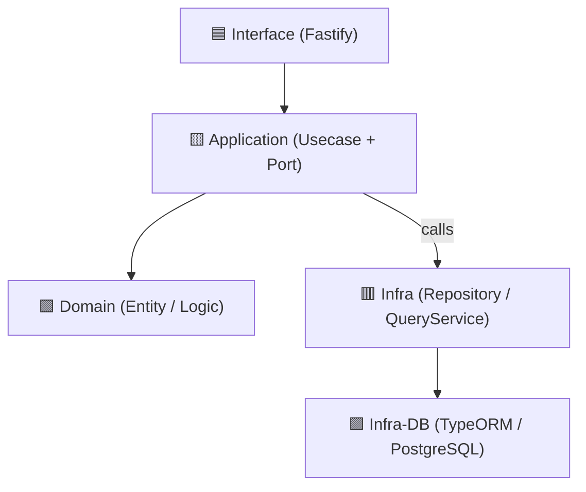

# 🎲 Board Game Rental App

モジュール分離・責務分離を徹底したアーキテクチャで構成された、ボードゲーム貸出管理アプリのバックエンド実装です。

このリポジトリは、以下の技術・設計原則の実例として構築されています：

- クリーンアーキテクチャ
- CQRS（Command/Query の責務分離）
- 関数型ユースケース
- モノレポ構成（TypeORM を共通基盤として分離）
- ポート&アダプター（依存の逆転）
- 完全な DI（依存注入）とテスト容易性
- TypeScript + Fastify + TypeORM

---

## 📐 Architecture Overview

本アプリケーションは、以下の構成を持ちます：

```
packages/
├── api/ # FastifyベースのAPI本体（クリーンアーキテクチャ）
└── infra-db/ # TypeORMのDataSource/Entity/migration/seedなど共通化
```

`api` はさらに以下のような構造を取ります：

```
modules/
└── game/
    ├── interface/ # http handler (Fastify)
    ├── application/ # Usecase（commands, queries）とPort定義
    ├── domain/ # Entityやドメインロジック（関数型）
    └── infra/ # RepositoryやQueryServiceの実装（TypeORMベース）
```

### 高レベル依存関係図（Contextual Layer）



#### 💡 補足：

矢印の方向は「依存方向」

依存の逆転が守られていることを可視化

---

## 💡 Domain: ボードゲーム貸出管理

### エンティティ例

- `Game`: ゲームの基本情報と貸出状態
- `Rental`: ゲーム貸出履歴（拡張予定）

---

## ✨ 技術スタック

| 項目           | 技術                      |
| -------------- | ------------------------- |
| 言語           | TypeScript                |
| フレームワーク | Fastify                   |
| DB             | PostgreSQL（TypeORM）     |
| アーキテクチャ | Clean Architecture + CQRS |
| テスト         | Jest                      |
| CI/CD          | GitHub Actions（予定）    |

---

## 🚀 開発手順

```bash
# clone & install
git clone https://github.com/<your-username>/board-game-rental-app.git
cd board-game-rental-app
yarn install

# DB起動（ローカルPostgreSQLが必要）
# migration, seed等は今後追加予定

# 起動
yarn workspace api dev
```

---

## 🧪 テスト

```bash
yarn test
```

## 🛠 今後の予定

- ユーザー管理の追加
- ゲーム予約機能（ドメイン整合性の表現）
- OpenSearch を用いたゲーム検索の実装
- E2E テスト（Playwright or supertest）
- GitHub Actions での CI 構築
- ER 図 & OpenAPI ドキュメントの自動生成
