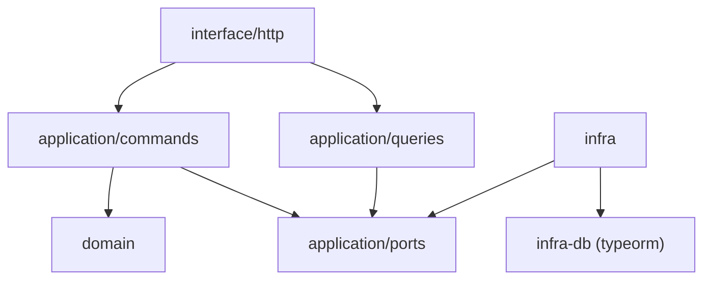

# 🧱 Architecture Overview

このドキュメントは、`board-game-rental-app` に採用されているアーキテクチャと設計思想を説明します。

---

## 🎯 目的（Purpose）

本アプリケーションは、以下の目的のもとで設計されています：

- クリーンアーキテクチャ + CQRS を適用した業務アプリケーション構成のサンプル実装
- モノレポによる構成管理とスケーラブルなパッケージ分離の実践
- 関数型ユースケースと依存注入（DI）によるテスト容易性と拡張性の向上
- 今後の業務応用やチーム開発の設計指針として再利用可能な構成

---

## 🧭 アーキテクチャ構成図

```
packages/
├── api/ # FastifyベースのAPI本体
│   └── src/
│       ├── modules/
│       │ └── game/
│       │ ├── interface/ # Fastifyハンドラー
│       │ ├── application/ # ユースケース（CQRS）とPort定義
│       │ ├── domain/ # ドメインエンティティとロジック
│       │ └── infra/ # RepositoryやQueryService実装（TypeORM）
│       └── shared/ # 共通ユーティリティ・型など
└── infra-db/ # RDB/DynamoDB/OpenSearchなどの共通化されたインフラ定義
```

---

## 🧱 採用アーキテクチャの要素

### ✅ クリーンアーキテクチャ

- **依存の逆転（DIP）** を遵守
- ドメイン層はアプリケーションのどの層からも独立
- `interface → application → domain` への一方向依存のみ許可

### ✅ CQRS（Command & Query Responsibility Segregation）

- Command：状態を変更する処理は `application/commands/` + `repository`
- Query：読み取りは `application/queries/` + `queryService`

### ✅ 関数型ユースケース（Pure Function Usecases）

- ユースケースはすべて「依存を引数で受け取る関数」として構成
- モックが容易で、テスト容易性が高い

### ✅ ポート＆アダプター（Port & Adapter）

- `application/ports/` に抽象（Port）を定義
- `infra/` 以下で実装（Adapter）を提供
- Adapter 層のテストも責務を明確に分離

---

## 🔄 依存構造の例

```text
interface (Fastify handler)
    ↓ calls
application (Usecase)
    ↓ via port
infra (Adapter = Repository/QueryService)
    ↓ uses
infra-db (TypeORM, PostgreSQL, etc)

```

### 高レベル依存関係図（Contextual Layer）

README 参照

### モジュール内構成図（modules/game 配下）



#### 💡 補足：

Command / Query のユースケースが、Port → Adapter という責務を通じてインフラと接続されていることが伝わる構成です。

---

## 🔍 テスト戦略

| 層                          | テスト内容                               | ツール                       |
| --------------------------- | ---------------------------------------- | ---------------------------- |
| ユースケース（application） | 純粋関数単体テスト                       | Jest                         |
| interface 層（Fastify）     | supertest による API 疎通                | Jest + supertest             |
| infra 層（Adapter）         | TypeORM を使った Repository の結合テスト | Jest（+ testcontainer 予定） |

## 🔌 今後の拡張設計（予定）

- OpenSearch を用いた全文検索の導入
- DynamoDB による一部ドメインのスキーマレス化
- Playwright による E2E テストの導入
- GraphQL エンドポイントの試験的追加（interface 層差し替え）
