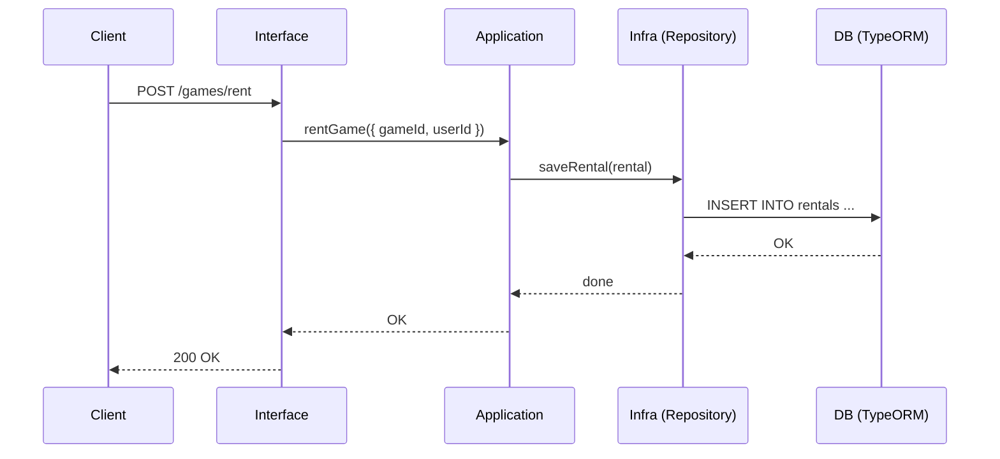

```mermaid
sequenceDiagram
  participant Client
  participant Fastify as Interface
  participant Usecase as Application
  participant Repo as Infra (Repository)
  participant DB as DB (TypeORM)

  Client->>Fastify: POST /games/rent
  Fastify->>Usecase: rentGame({ gameId, userId })
  Usecase->>Repo: saveRental(rental)
  Repo->>DB: INSERT INTO rentals ...
  DB-->>Repo: OK
  Repo-->>Usecase: done
  Usecase-->>Fastify: OK
  Fastify-->>Client: 200 OK

```
